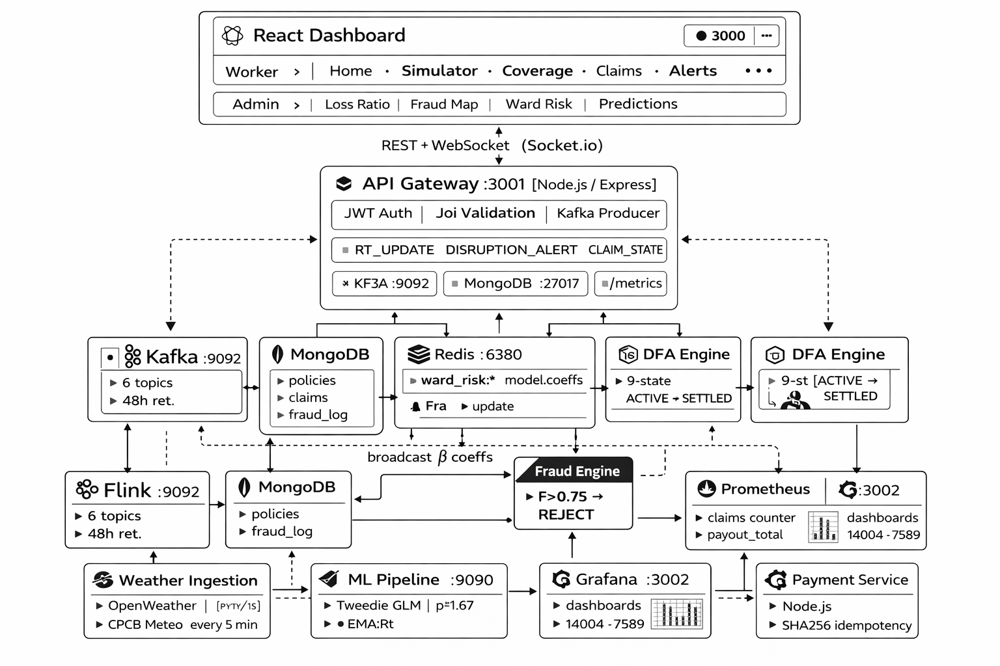
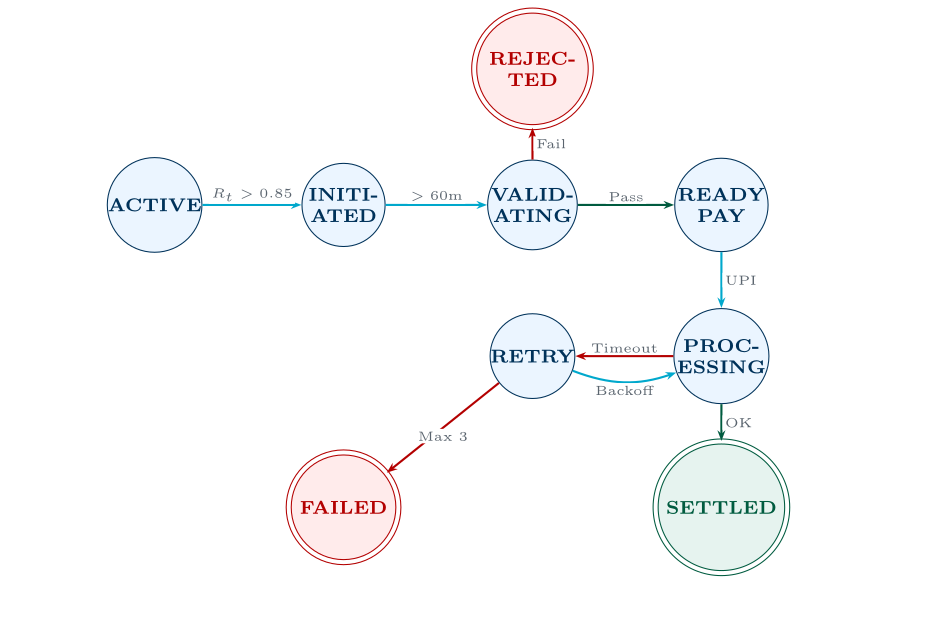

<div align="center">

<br/>

```
   ██████╗ ██████╗  █████╗ ██████╗
  ██╔════╝ ██╔══██╗██╔══██╗██╔══██╗
  ██║  ███╗██████╔╝███████║██████╔╝
  ██║   ██║██╔══██╗██╔══██║██╔═══╝
  ╚██████╔╝██║  ██║██║  ██║██║
   ╚═════╝ ╚═╝  ╚═╝╚═╝  ╚═╝╚═╝
```

**Geo-Responsive AI-Parametric Insurance Platform**

*Zero-touch income protection for India's 7 million+ gig delivery workers*

<br/>

[](https://www.guidewire.com)
[](#architecture)
[](#golden-rules)
[](#overview)
[](LICENSE)

<br/>

</div>

---

## Overview

GRAP is a **parametric income insurance platform** that automatically compensates food delivery partners (Zomato, Swiggy) when external disruptions — extreme rainfall, hazardous AQI, floods, or social events — prevent them from earning. When objective indices breach thresholds, claims trigger and pay out within 48 hours. No forms. No phone calls. No waiting.

> **When it rains in Kurla, Ramesh should not lose a week's income. GRAP ensures he doesn't — automatically, instantly, and fairly.**

<br/>

## Golden Rules

| # | Rule | Detail |
|---|------|--------|
| 1 | **Persona** | Food Delivery Partners on Zomato / Swiggy exclusively |
| 2 | **Coverage** | Lost income from external disruptions only — vehicle, health, accident, and life insurance are excluded |
| 3 | **Pricing** | Weekly dynamic premium (₹12–55/week) via Tweedie GLM, recalculated every Monday at 02:00 IST |

<br/>

## Prerequisites

| Tool | Version | Purpose |
|------|---------|---------|
| Docker & Docker Compose | v2+ | All backend services |
| Node.js | 20 LTS | Frontend + API gateway |
| npm | 10+ | Package management |
| Python | 3.11+ | ML pipeline, fraud engine |

<br/>

## Quick Start

### 1 — Configure environment

```bash
cp .env.example .env
```

The project runs out of the box with mock values. External API keys (OpenWeather, CPCB, Razorpay) are optional — all services fall back to realistic mock data when keys are absent.

---

### 2 — Start all backend services

```bash
docker compose up -d
```

| Service | Port | Description |
|---------|------|-------------|
| API Gateway | `3001` | REST + WebSocket (Socket.io), Prometheus `/metrics` |
| Kafka | `9092` | 6-topic event bus, 48h retention |
| MongoDB | `27017` | Policies, claims, fraud logs |
| Redis | `6380` | S2 spatial index, ward risk scores, model coefficients |
| Risk Scorer | `8081` | Flink EMA risk scoring (Rt) |
| Weather Ingestion | `8002` | Polls OpenWeather, Open-Meteo, CPCB every 5 min |
| Fraud Engine | `8003` | 4-layer composite fraud scoring |
| ML Pipeline | `8004` | Tweedie GLM — weekly retrain |
| DFA Engine | — | 9-state deterministic claim lifecycle |
| Payment Service | — | Razorpay UPI sandbox |
| Prometheus | `9090` | Metrics collection |
| Grafana | `3002` | Dashboards — login: `admin / admin` |

Verify everything is healthy:

```bash
docker compose ps
```

---

### 3 — Seed the database *(first run only)*

```bash
docker compose --profile seed run --rm seed
```

Inserts 500 mock workers across 5 Mumbai wards (Kurla, Andheri West, Dharavi, Malabar Hill, Bandra).

---

### 4 — Start the React dashboard

```bash
cd apps/dashboard
npm install
npm run dev
```

Open **[http://localhost:3000](http://localhost:3000)**. API calls proxy automatically to the backend at `localhost:3001`.

---

### Stop everything

```bash
# Stop frontend
Ctrl+C

# Stop all backend containers
docker compose down

# Stop and wipe all data volumes
docker compose down -v
```

<br/>

## Demo — End-to-End Disruption Simulation

Run the simulation script to watch a full claim lifecycle in under 2 minutes:

```bash
# Reduce the 60-minute claim gate to 1 minute for demo purposes
CLAIM_GATE_MINUTES=1 python data/simulate_disruption.py
```

**What happens:**

```
Step 1  Sets rainfall = 0.92 (46 mm/hr) in Kurla ward via Redis
Step 2  Sends telemetry pings for worker GIG_0001
Step 3  Risk score Rt rises:  0.532 → 0.673 → 0.791 → 0.871  ✓ threshold crossed
Step 4  Claim lifecycle:
          ACTIVE → INITIATED → VALIDATING → READY_PAY → PROCESSING → SETTLED
Step 5  Payout of ₹133.93 issued to GIG_0001 via Razorpay sandbox UPI
```

**Rt calculation (inline):**
```
Rt = 0.7 × (0.60×0.92 + 0.15×0.25 + 0.10×0.80 + 0.15×0.60)
   = 0.7 × 0.76
   = 0.532   →  rises above 0.85 after 2–3 sustained 30-second cycles
```

<br/>

## Architecture



<br/>

## Project Structure

```
grap/
├── apps/
│   ├── api-gateway/           # Node.js — JWT, Kafka producer, WebSocket, Prometheus
│   ├── dfa-engine/            # Node.js — 9-state DFA claim lifecycle
│   └── dashboard/             # React TypeScript — Worker + Admin dashboards
│
├── services/
│   ├── weather-ingestion/     # Python — OpenWeather, Open-Meteo, CPCB polling
│   ├── fraud-engine/          # Python — 4-layer composite fraud scoring
│   ├── payment-service/       # Node.js — Razorpay UPI sandbox
│   ├── ml-pipeline/           # Python — Tweedie GLM, Bühlmann credibility
│   └── flink-jobs/            # Python — EMA risk scoring (Rt)
│
├── data/
│   ├── seed.py                # 500 workers, 5 Mumbai wards
│   └── simulate_disruption.py # End-to-end demo script
│
├── infra/
│   ├── kafka-topics.sh        # Pre-create all 6 topics
│   ├── prometheus.yml         # Scrape config
│   └── grafana/               # Auto-provisioned dashboards
│
├── docker-compose.yml
├── .env.example
└── README.md
```

<br/>

## Key Formulas

| Formula | Where implemented |
|---------|------------------|
| `Rt = α·Rt₋₁ + (1−α)·ΣwᵢTᵢ` — EMA risk score | `services/flink-jobs/risk_scorer.py` |
| `ln(µᵢ) = β₀ + Σβⱼxⱼ` — Tweedie GLM premium | `services/ml-pipeline/main.py` |
| `Zᵢ = nᵢ/(nᵢ+k)` — Bühlmann credibility | `services/ml-pipeline/main.py` |
| `Y = (WeeklySI/7) / DST × Hours` — pro-rata payout | `apps/dfa-engine/src/dfa/state-machine.js` |
| `F = Σλⱼ·sⱼ, reject if F > 0.75` — composite fraud score | `services/fraud-engine/main.py` |
| `SHA256(claim‖worker‖week)` — idempotency key | `apps/dfa-engine/src/server.js` |

<br/>

## Kafka Topics

| Topic | Partitions | Retention | Purpose |
|-------|-----------|-----------|---------|
| `worker-telemetry` | 12 | 48h | GPS, accelerometer, activity pings from SDK |
| `environmental-context` | 4 | 48h | Rain, AQI, flood alerts from weather service |
| `social-disruption` | 4 | 48h | Strike/curfew events from OVA/IDR/NER |
| `claim-events` | 8 | 48h | DFA state transitions |
| `fraud-signals` | 8 | 48h | Fraud scoring requests and verdicts |
| `payout-commands` | 4 | 48h | UPI payout instructions to payment service |

> 12 partitions on `worker-telemetry` enables Flink to parallelize across 12 task slots, handling 500k+ events/sec at ~41k events/sec per partition.

<br/>

## DFA Claim Lifecycle



Terminal states: `SETTLED` (success) · `REJECTED` (fraud) · `FAILED` (payment failure)

<br/>

## Privacy & Compliance (DPDPA 2023)

| Control | Detail |
|---------|--------|
| **Raw GPS** | Deleted 7 days after claim settlement (MongoDB TTL index) |
| **Accelerometer data** | Never written to storage — processed in-stream only |
| **k-anonymity** | Location records published only when k ≥ 5 workers share same S2 Level 10 cell in the same 30-minute window |
| **Habitual locations** | Cells visited > 5×/week flagged and excluded from all analytics |
| **Right to erasure** | Deletion requests honoured within 72 hours (Article 12) |
| **Telemetry pause** | Worker can pause location sharing at any time; coverage suspends automatically |
| **Admin dashboard** | Shows S2 cell IDs only — no raw GPS coordinates are ever exposed |

<br/>

## Known Limitations

| Limitation | Impact | Mitigation in prototype |
|------------|--------|------------------------|
| Flink runs as standalone Python | Not a full PyFlink cluster | Functional for local demo; production would use Flink 1.18 cluster |
| Razorpay in sandbox mode | No real money movement | Set `RAZORPAY_KEY_ID` + `RAZORPAY_SECRET` for live sandbox |
| Weather falls back to mock data | Static risk values when API key absent | Set `OPENWEATHER_KEY` and `APISETU_KEY` in `.env` |
| S2 cell computation approximated | Slightly imprecise geofence boundaries | Production uses `s2sphere` Python library |
| 60-min claim gate | Slow for live demos | Override with `CLAIM_GATE_MINUTES=1` |
| Platform OAuth simulated | No real Zomato/Swiggy login | Production requires data-sharing MOU |

<br/>

## Tech Stack

| Layer | Technology |
|-------|-----------|
| Frontend | React 18 · TypeScript · shadcn/ui · Tailwind CSS · Recharts · Lucide |
| API Gateway | Node.js · Express · Socket.io · KafkaJS · prom-client |
| Event Bus | Apache Kafka 7.5 · 6 topics · exactly-once semantics |
| Stream Processing | Apache Flink 1.18 · RocksDB state backend · 30s checkpoints |
| Claim Engine | Node.js · 9-state DFA · SHA256 idempotency |
| Fraud Detection | Python · FFT (numpy) · OpenCelliD · Play Integrity |
| ML Pipeline | Python · scikit-learn TweedieRegressor · joblib · pandas |
| Weather Ingestion | Python · OpenWeather · Open-Meteo · CPCB API Setu |
| Databases | MongoDB 7 · Redis 7.2 · S3 Parquet (cold archive) |
| Observability | Prometheus · Grafana · dashboards 14004 + 7589 |
| Payments | Razorpay UPI sandbox |

<br/>

---

<div align="center">

Built for **Guidewire DEVTrails 2026** · Persona: Food Delivery Partners · Coverage: Income Loss Only

*Parametric · Zero-touch · Weekly pricing · Automated UPI payouts*

</div>